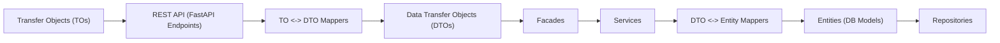

# Application Architecture

The application is structured in a clear, acyclic layered architecture. The flow of a typical request is as follows:

1. **Transfer Objects (TOs)**: Data interface objects, often used for request/response schemas.
2. **REST API (FastAPI Endpoints)**: Entry point for HTTP requests, consuming and returning TOs.
3. **TO <-> DTO Mappers**: Adapt and map TOs to Data Transfer Objects (DTOs) and vice versa.
4. **Data Transfer Objects (DTOs)**: Used for business logic and service layer communication.
5. **Facade Layer**: Orchestrates business logic and coordinates multiple services.
6. **Service Layer**: Implements business logic and interacts with repositories and mappers.
7. **DTO <-> Entity Mappers**: Services use these mappers to convert DTOs to Entities (database models) and vice versa before calling repositories.
8. **Entity Layer**: Defines the database models/entities.
9. **Repository Layer**: Handles data persistence and retrieval, working directly with Entities.

## Architecture Diagram

