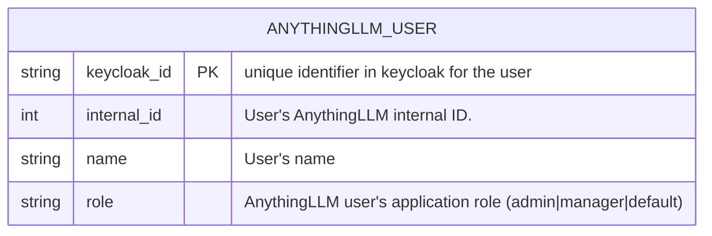

# Database Entity Relationship Diagram (ERD)

This document provides an overview of the core database entities and their relationships as used in the system.
The model is implemented using SQLAlchemy and SQLModel, and provides a single table to store the information for users matching minimal data from keycloak and anythingllm.

Below is the Entity Relationship Diagram (ERD) representing the main tables and their relationships:

> **Note:** This ERD is generated from the Python ORM and DBML schema definitions. For further details, see the entity source code in `src/sso_anythingllm_entity/`.  
